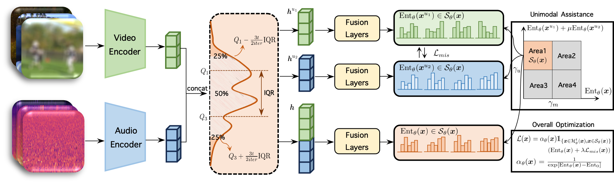

# SuMi

[ICLR 2025] Smoothing the Shift: Towards Stable Test-Time Adaptation under Complex Multimodal Noises

## Overview

**TL;DR**: We reveal a new challenge named *multimodal wild test-time adaptation*.

Three Key Components:
- IQR smoothing: smoothing the abrupt shift of complex multimodal noises.
- Sample identification: identifying the samples that are beneficial for the model adaptation.
- Mutual information sharing: enhancing robustness of the model.



## Getting Started
### Installation
```bash
git clone https://github.com/zrguo/SuMi
```

Package Requirements: torch, torchaudio, timm, scikit-learn, numpy


### Preparing the data
You can prepare the data by following the instructions of the [benchmark](https://github.com/XLearning-SCU/2024-ICLR-READ).

### Running the code
You can run the code using the command:
```bash
python main.py --dataset 'ks50' --json-root [json-root] --label-csv [label-csv] --pretrain_path [pretrain_path] --tta-method 'sumi' --severity 5 --corruption-modality 'video'
```

## Citation
If you find this code useful, please cite our paper:
```bibtex
@inproceedings{
guo2025smoothing,
    title={Smoothing the Shift: Towards Stable Test-Time Adaptation under Complex Multimodal Noises},
    author={Zirun Guo and Tao Jin},
    booktitle={The Thirteenth International Conference on Learning Representations},
    year={2025}
}
```
